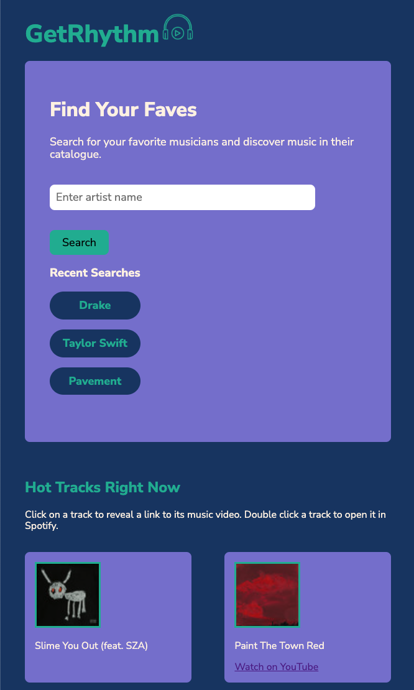

# get-rhythm

## Description

We created this app to help users find music by their favorite artists, and see music that's hot that day. Sometimes it can be difficult to find your favorite artists' entire discography in a quick- and easy-to-consume manner.

Users can search for any artist's name and will be presented with the albums in their discography. If the user clicks on any album, they will be able to see songs in the album. If a song is double clicked, the user is presented with a link to the selected song on YouTube. Users can also be linked to an album in Spotify by double clicking on the album. 

Hot Tracks display the top 5 tracks in the US at the time of loading the page. If a user clicks on a hot track, they are presented with a link to view the track's music video on YouTube. If the user double clicks on a hot track, they will be taken to that song in Spotify.

See Live App Here: https://whitbreezy.github.io/get-rhythm/

## Installation

See repo in github and clone to your machine:

https://github.com/whitbreezy/get-rhythm

## Usage

User can enter an artist to view albums in their discography.

User can click on an album to view its songs.

User can double click an album to view it in Spotify.

User can click on a song to view a link to its music video in YouTube

User can click on a Hot Track to view a link to its music  video in YouTube.

User can double click on a hot track to view the track in Spotify.

### App Screenshots

Desktop:

Tablet:

Mobile:

## Credits

### Collaborators:

Max Heath - https://github.com/MaxHeath1

John Shumway - https://github.com/johnnsandra

Rafael Olivan - https://github.com/pfarctol

Whitney Brady - https://github.com/whitbreezy

### APIs

https://developers.google.com/youtube/v3/docs/search/list

https://developer.spotify.com/documentation/web-api

## License

See repo for licensing info.

